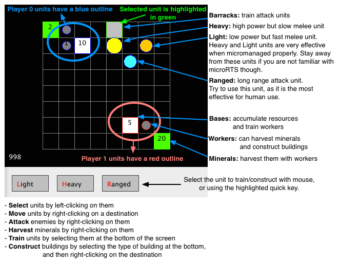
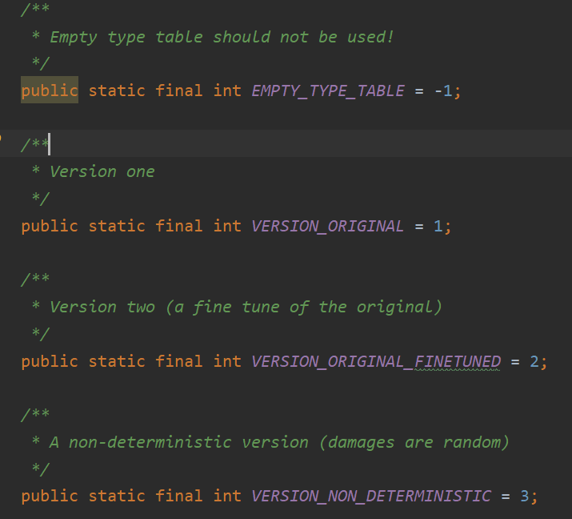
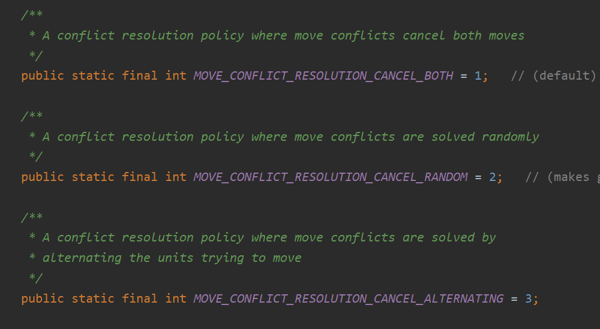
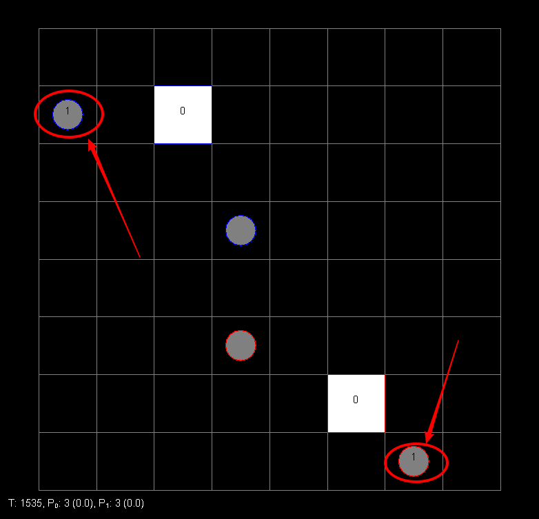
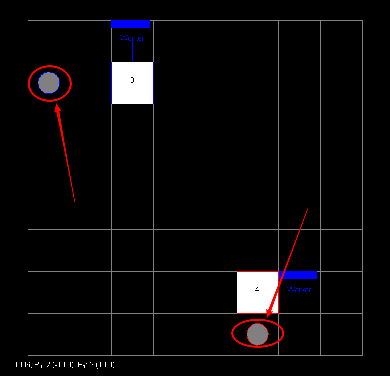
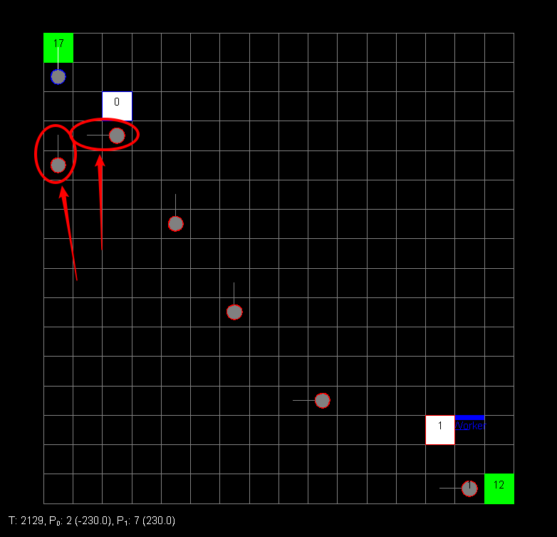

# 本项目源自：[链接](https://github.com/santiontanon/microrts)

## 规则说明

## 本项目介绍
本项目是2019年东南大学算法设计课程要求设计出一个RTS策略，并用于课堂上比赛用的。
所写的算法都是基于无战争迷雾的情况。

版本一共有三个版本

冲突的解决方式有三种: 

课程要求：
版本采用1(原始版本)，冲突解决(冲突双方均停下来)
无战争迷雾
map: 16x16/basesWorkers16x16.xml、BWDistantResources32x32.xml
#### 策略介绍
1. 小地图(16*16以下，包括16*16，经过测试是比较理想的)基于workRushPlus改进的。
改进一：充分利用资源

注意到在最后workRushPlus中没有把最后的一个资源放进基地中
改进如下：

改进二：小地图优先攻击worker, 在攻击基地

2. 第二个地图中（32*32），采用积累兵力在进行攻击。

注：在[代码](src/MyRTS/BoJingAI.java)中写出了各种地图的情况，都是无战争迷雾的，只需调整参数即可。